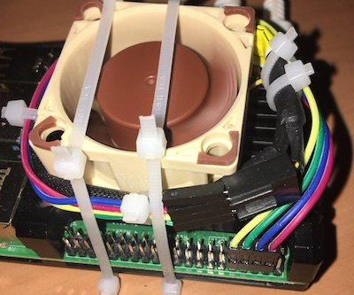

# fancy
### Raspberry Pi PWM Fan Control Service

Hardware prerequisites: Raspberry PI and 5V-fan with pwm pin.
Software prerequisites: Debian Buster, Python 3, bash

For installation type:

    sudo bash ./install.sh

Configuration goes to /etc/fancy.conf.

Fan installation (Pin 8 is GPIO 14):

    ____________________     
    |                  |      Fan
    |  Raspi      1  2 |
    |             3  4-|----  +5V
    |             5  6-|----- GND
    |             7  8-|----- PWM
    |             9 10-|------Tacho
    ~~~~~~~~~~~~~~~~~~~~

3 color LED installation:

    ~~~~~~~~~~~~~~~~~~~~ 
    |  Raspi     15 16-|---[220R]---red LED cathode
    |            17 18-|---[220R]---green LED cathode
    |             \----|------------LED anode
    |            21 22-|---[220R]---blue LED cathode
    ~~~~~~~~~~~~~~~~~~~~
